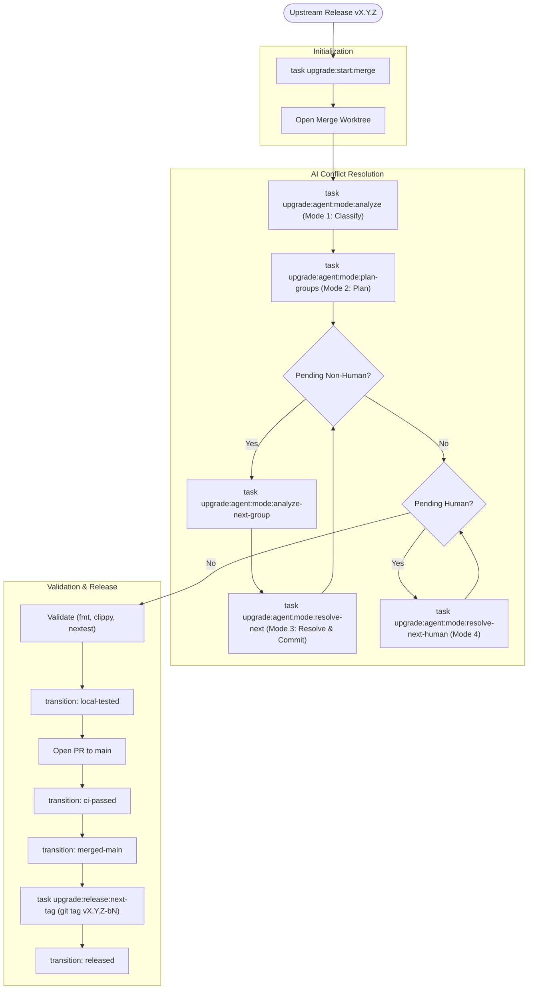

# Upstream Release Strategy (ADI + Matter Labs)

This is the canonical strategy for syncing upstream releases from
`matter-labs/zksync-os-server` into `ADI-Foundation-Labs/ADI-Stack-Server`.

## Final Decisions

1. `main` stays the ADI branch with the latest ADI changes.
2. We do not maintain a mirrored upstream `main` in this repository.
3. We maintain upstream release branches only, named `upstream/vX.Y.Z`.
4. For every upstream release `vX.Y.Z`, ADI publishes `vX.Y.Z-bN` (`N` increments for repeat release attempts).
5. Upstream syncs happen via PRs, never direct pushes to `main`.
6. Merge process state is tracked in `.ops/merge-status.yaml`.
7. AI merge conflict handling uses mode-based runs with persisted state in `.ops/.tmp/upstream-radar/.../merge-agent-state.yaml`.
8. Conflict resolution is executed as commit-friendly groups (one group = one commit).

## Historical Audit (Current Repository)

Observed from local git history:

1. The repo currently has one upstream release branch: `origin/upstream/v0.12.1`.
2. Historical release tags are mixed:
   - Existing exact tag example: `v0.8.4`
   - Legacy ADI suffix tags: `v0.10.0-b`, `v0.10.1-b*`, `v0.12.1-b`, `v0.13.0-b`
3. Several legacy version tags are not ancestors of current `main`.
   - This indicates prior releases were sometimes cut from side branches.
4. `origin/upstream/v0.12.1` is not an ancestor of current `main`.
   - This confirms historical non-linear upgrade flow.
5. There is no persistent local `upstream` remote configured by default in this clone.

Implication: we need stricter release ancestry rules and explicit upstream sync branches.

## Consolidated Strategy From Discussion Notes

What all notes agreed on:

1. Current pain comes from ad-hoc merges into a branch with custom changes.
2. Upstream sync must be standardized and automated.
3. `git rerere` should be enabled to reuse conflict resolutions.
4. AI should assist conflict handling, but protected branches need human approval.

What differed:

1. Rebase-first model vs merge-forward model.
2. Upstream mirror branch model vs ADI-on-main model.

Chosen model for this repo:

1. Merge-forward into `main` (no history rewrite).
2. Upstream release branches (`upstream/vX.Y.Z`) as the merge source.
3. ADI release tags use `vX.Y.Z-bN` after merge to `main`.

Reason: this matches the repo's operating reality and avoids rebasing long-lived ADI history.

## Branch and Tag Conventions

Branches:

1. `main`:
   - ADI production branch.
   - Must contain only reviewed merges.
2. `upstream/vX.Y.Z`:
   - Branch tip created from upstream tag `vX.Y.Z`.
   - Never used for feature work.
3. `merge/upstream-vX.Y.Z`:
   - Temporary integration branch from `main`.
   - Used to resolve conflicts and run CI before PR.

Tags:

1. Upstream source tag format: `vX.Y.Z`.
2. ADI release tag format: `vX.Y.Z-bN` (e.g. `v0.14.2-b1`, `v0.14.2-b2`).
3. Tag location: merge commit on `main` that contains the upstream sync + ADI changes.
4. Legacy `-b` tags remain historical; new flow uses explicit numeric suffix (`-b1`, `-b2`, ...).

## Merge State Tracking

Primary state files:

- `.ops/merge-status.yaml`
- `.ops/.tmp/upstream-radar/<base_slug>__<target_slug>/merge-agent-state.yaml`

Key fields:

1. `tags.previous_upstream_tag`
2. `tags.current_upstream_tag`
3. `merge.status`
4. `merge.base_ref`
5. `merge.merge_branch`
6. `merge.worktree_path`
7. `radar.*` metrics from merge analysis
8. `analysis.*` in merge-agent-state (`easy`, `medium`, `hard`, `human_input_needed`)
9. `groups[]` in merge-agent-state (group intent, files, difficulty, status, commit message)
10. `resolution.next_group` and `resolution.next_human_group` in merge-agent-state

Update behavior:

1. `task upgrade:start:merge -- vX.Y.Z` is the primary entrypoint:
   - syncs `upstream/vX.Y.Z`
   - ensures merge worktree `merge/upstream-vX.Y.Z` exists
   - runs merge in the worktree
   - updates `merge-status.yaml`
   - runs merge radar and stores artifacts
2. `task upgrade:status:show` prints current state.
3. `task upgrade:status:next` prints a dynamic recommendation and a visual flowchart for the next step.
4. Artifacts from radar tools are written to `.ops/.tmp/upstream-radar/...`.
5. `task upgrade:status:transition -- <phase>` enforces lifecycle transitions (`local-tested`, `ci-passed`, `merged-main`, `released`, `aborted`, `idle`).

## AI Conflict Resolution Modes

Mode files live in:

- `.agents/skills/upstream-merge-conflicts/references/mode-initial-analyze.md`
- `.agents/skills/upstream-merge-conflicts/references/mode-plan-groups.md`
- `.agents/skills/upstream-merge-conflicts/references/mode-resolve-group.md`
- `.agents/skills/upstream-merge-conflicts/references/mode-resolve-human-group.md`

Execution model:

1. `analyze`: classify unresolved files into `easy|medium|hard|human_input_needed`.
2. `plan-groups`: build commit-friendly groups with bounded difficulty.
3. `resolve-group`: resolve one non-human group and create one commit.
4. `resolve-human-group`: resolve or explicitly block one human-input group.

## Standard Runbook (Per Upstream Release)

Assume upstream released `vX.Y.Z`.

### Merge Flow Diagram



### Step-by-Step Execution

0. Define project/worktree paths:

```bash
PROJECT_NAME="ADI-Stack-Server"
TAG="vX.Y.Z"
WT_ROOT="${HOME}/.local/git/wortrees/${PROJECT_NAME}"
WT_PATH="${WT_ROOT}/merge-upstream-${TAG}"
```

1. Start merge session (from any branch):

```bash
task upgrade:start:merge -- ${TAG}
```

This command handles:

- active merge guardrails
- upstream tag/branch sync
- merge worktree creation/reuse
- merge execution
- artifact generation (merge radar & conflict diffs)
- merge status updates

> [!NOTE]
> The `start:merge` command automatically runs `merge-radar` and `conflict-diffs` in the background. From a high level, these tools analyze the complexity of the merge and generate per-conflict patch artifacts (separating ADI vs upstream changes) to help both developers and AI agents understand the diffs better. For more information, see [Fast Merge-Difficulty Analysis](#fast-merge-difficulty-analysis).

Optional flags:

```bash
task upgrade:start:merge -- ${TAG} --push-upstream --push-merge
```

2. Open merge worktree in IDE (optional):

```bash
task upgrade:open:merge-worktree -- cursor
# or explicit tag:
task upgrade:open:merge-worktree -- code ${TAG}
```

3. Run mode 1 (initial analyze):

```bash
task upgrade:agent:mode:analyze -- ${TAG} [agent]
```

4. Run mode 2 (plan groups):

```bash
task upgrade:agent:mode:plan-groups -- ${TAG} [agent]
```

5. Analyze next non-human group:

```bash
task upgrade:agent:mode:analyze-next-group -- ${TAG} [agent]
```

6. Resolve non-human groups (repeat analyze and resolve until no pending non-human groups):

```bash
task upgrade:agent:mode:resolve-next -- ${TAG} [agent]
```

7. Resolve human groups separately (repeat as needed):

```bash
task upgrade:agent:mode:resolve-next-human -- ${TAG} [agent]
```

`[agent]` is optional; tasks default to `claude`.

8. Validate:

```bash
cargo fmt --all --check
cargo clippy --all-targets --all-features --workspace -- -D warnings
cargo nextest run --workspace
```

9. Mark local validation complete:

```bash
task upgrade:status:transition -- local-tested
```

10. Open PR from worktree branch:

    - Source: `merge/upstream-vX.Y.Z`
    - Target: `main`
    - Include:
      - upstream tag merged
      - group commit summary
      - blocked human-decision groups (if any)
      - test results

11. After CI succeeds:

```bash
task upgrade:status:transition -- ci-passed
```

12. After PR merge, mark merge state and create release tag:

```bash
task upgrade:status:transition -- merged-main
task upgrade:release:next-tag -- ${TAG}
git tag "${TAG}-bN"
git push origin "${TAG}-bN"
task upgrade:status:transition -- released --release-tag ${TAG}-bN
```

13. Cleanup local worktree:

```bash
git worktree remove "${WT_PATH}"
```

14. Publish GitHub Release notes:

- Base upstream: `matter-labs/zksync-os-server@vX.Y.Z`
- ADI delta summary (what changed on top)
- CI/test status

## Conflict Resolution Notes

1. Enable `rerere` once:
   `git config --global rerere.enabled true`
2. Always run modes in order: `analyze` -> `plan-groups` -> `analyze-group` -> `resolve-group`/`resolve-human-group`.
3. Keep each group meaningful and committable; avoid combining multiple hard files in one group.
4. Create one commit per resolved group.
5. Keep human-required decisions isolated in human groups with explicit notes.
6. Do not edit `.ops/merge-status.yaml` manually; use `task upgrade:status:*`.

## Review and Safety Checks

Use this minimum checklist for every upstream update:

1. `upstream/vX.Y.Z` branch tip matches upstream tag.
2. Merge PR to `main` is reviewed by at least one maintainer.
3. No direct push to `main`.
4. Tag `vX.Y.Z-bN` is created only after merge to `main`.
5. Release notes include upstream base and ADI delta.

## Fast Merge-Difficulty Analysis

The upgrade flow leverages two specialized analysis tools to break down merge complexity before any conflicts are resolved. These tools run automatically during `task upgrade:start:merge`, but can also be triggered manually using the preferred commands:

```bash
task upgrade:analyze:merge-radar -- ${TAG} main
task upgrade:analyze:conflict-diffs -- ${TAG} main
```

### 1. Merge Radar (`task upgrade:analyze:merge-radar`)

**What it creates:**
Generates a complexity report (`report.md`) and lists of changed files (categorized into ADI-only, upstream-only, and overlap) under `.ops/.tmp/upstream-radar/<base_slug>__<target_slug>/`.

**How it is used in the upgrade flow:**
Provides a macro-level structural overview of the merge. It is crucial for both human reviewers (to understand the sheer scale of the upgrade) and the AI agent (which uses this structural data during its initial `analyze` mode to classify files into `easy`, `medium`, `hard`, or `human_input_needed`).

### 2. Conflict Diffs (`task upgrade:analyze:conflict-diffs`)

**What it creates:**
Extracts clean, per-conflict patch artifacts that isolate the upstream-specific changes from the ADI-specific changes for every file actively in a conflict state. These are stored alongside the radar artifacts.

**How it is used in the upgrade flow:**
Provides micro-level context. Standard `git diff` during a conflict can be noisy and hard to parse. These isolated patches allow the AI merge agent (and human developers) to see exactly what ADI changed vs what upstream changed, reducing context-window exhaustion and enabling fine-grained, patch-based resolution.

### Opinionated Defaults

When running these commands manually:

1. If `base_ref` is omitted, scripts use `upstream/<current_upstream_tag>` from `.ops/merge-status.yaml`.
2. If `target_ref` is omitted, scripts use `merge.merge_branch` (if it exists locally), else `main`.
3. If an active merge exists and refs are omitted, run commands from the active merge worktree path.

## Historical Replay Regression Tests

Goal: prevent regressions in merge tooling (including AI-assisted merge flows) by replaying historical merges.

Build historical mapping:

```bash
task upgrade:history:build-release-lineage
```

This generates:

- `.ops/release-lineage.yaml`

Build replay cases:

```bash
task upgrade:test:build-replay-cases
```

This generates:

- `.ops/merge-replay-cases.yaml`

Run replay tests:

```bash
task upgrade:test:run-replay
```

`upgrade:test:run-replay` exits non-zero when any case fails.

For each case, tooling:

1. checks out `pre_tag_commit` in a temporary clone
2. merges mapped upstream commit
3. compares resulting tree to expected historical tagged commit tree
4. reports pass/fail and writes results under `.ops/.tmp/merge-replay-runs/...`

Assertion modes:

1. `exact_tree` (default): resulting tree hash must match expected tree hash.
2. `allow_paths_delta`: allow differences only in explicit whitelisted paths (for controlled non-determinism).

AI assertion hooks can be added as a secondary layer, but deterministic git/tree checks remain mandatory baseline assertions.

## Automation Plan (Recommended)

1. Scheduled workflow (daily or weekly):
   - checks latest upstream release tag
   - compares to latest ADI release tag
2. If new upstream tag exists:
   - creates/updates `merge/upstream-vX.Y.Z`
   - opens PR to `main`
   - posts conflict/test summary
3. Use token strategy that allows downstream workflows to run:
   - GitHub App or PAT for PR-creating bot workflows
4. Human approval remains mandatory for merge and release publishing.

## Handling Legacy History

Legacy `-b` tags and side branches are kept for traceability, but future releases follow:

1. upstream base tracked as `vX.Y.Z`, ADI releases tagged `vX.Y.Z-bN`
2. tags cut from `main` only
3. upstream release branch + PR integration flow only
